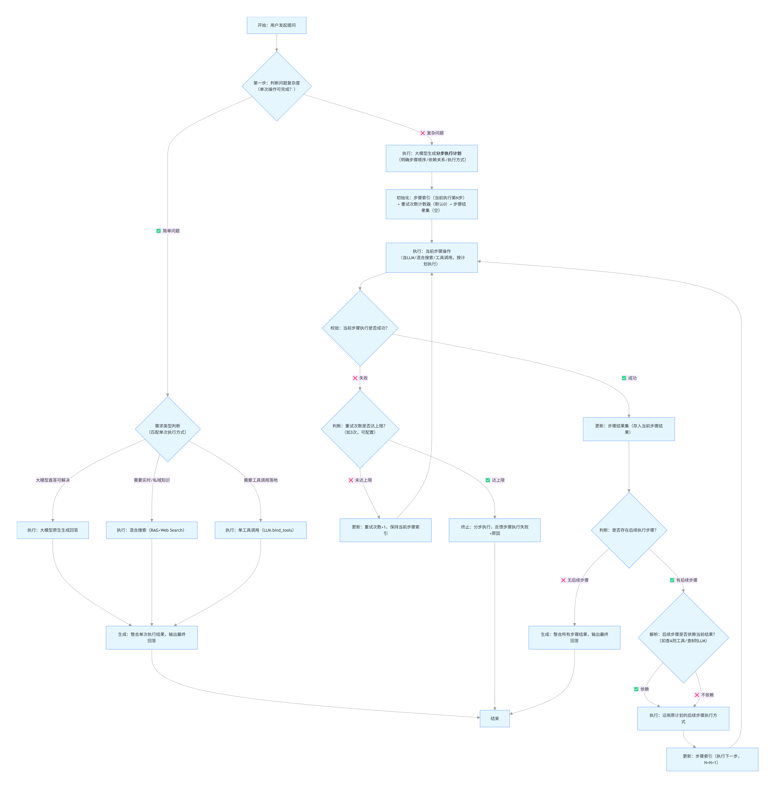

# 设计思路
一期:
    完成使用django+langchain实现单agent进行服务的功能。
    功能包括:
        1. 对话
            对话分为普通聊天和事项相关,事项相关对话会根据用户输入自动切换当前咨询的事项,将当前咨询事项的长期记忆作为系统提示词加入对话中,如果用户需要操作事项则自动路由跳转到事项。
        2. 事项
            事项包括
                任务: 周期任务/一次性任务有状态
                文档: 事项相关的文档


# 开发日志
## 2025-11-19

### 添加用户聊天偏向配置页面
- 提示词  
请帮我生成一个用户聊天偏向配置页面的HTML模板,包括表单字段:用户姓名,聊天偏向(例如:专业,通用,情感支持等),提交按钮等,页面风格清新可爱,包含CSS样式
在主页左上角加入一个链接,点击后跳转到该页面
用户聊天偏向配置页面在chat目录下
用户聊天偏向配置model为chat.models.UserChatProfile

- 提示词
聊天风格偏好chat_preference.html
修改下展示样式,增加风格描述以较小字体展示在风格名称下面
风格改为
邻家暖男,霸道总裁,开朗潮男
青梅女孩,职场丽人,知心姐姐
三男三女 通过css样式区分性别
chat_preference.html也需要嵌套仅login的base.html或index.html中,可以随时切换到其它页面。


请给我讲解一下
django项目的api请求流程是什么样的？从浏览器或者postman发起请求开始讲。
要求以chat.view.py 的chat函数为例
并且结合django的用户系统,在调用chat函数时传入用户id,以便于获取用户信息。

## 2025-11-20
交互设计思路
    以对话+操作共同构成交互方式
    例如：
        用户登录后进入主页进行对话式交互,根据用户输入内容,可以有如下操作
        1. 直接回复
        2. 调用工具并直接回复
        3. 跳转到计划/任务/文档库等页面进行后续操作,这些页面都已操作表单为主,根据表单内容对话为辅。
    全局会话共享聊天记录
    功能组成
        对话
        主题
            主题是对话的核心,用户对话时会自动判断意图切换主题
            主题的构成有
                文档集
                计划
                事项
                主题总结(每天更新)
    会话组成
        系统提示词
            功能提示词
            用户聊天偏向配置
            当前功能数据
        用户提示词
            全局聊天记录
            当前用户输入

## 2025-11-26
    结合现有代码实现功能如下:
        1. 搭建用户对话html页面(chat.html)
        2. 实现用户对话功能,包括用户输入和系统回复
        3. 用户未登录时或登录失效时,跳转到登录界面
        4. 在现有业务中加入‘事项’概念,事项概念为用户需要完成的事情或者需要记录的事件。事项有进行中,已完成,已取消三种状态。事项有专属的长期记忆字段,每30分钟在后台自动更新一次,长期记忆根据用户在当前事项的对话记录进行梳理,总结用户在当前事项上的重点事件,并存储到长期记忆字段中,格式为 时间:事件描述;时间:事件描述;
        5. 搭建事项页面(issue.html),包括事项列表,创建,详情等
        6. 用户对话页面可以选择对话事项,也可以通过用户对话自动切换当前咨询的事项,将当前咨询事项的长期记忆作为系统提示词加入对话中。
    
    使用ai编码成果: 
        实现了对话页面,实现了事项功能,但是事项的规划功能未实现。
        未实现通过对话创建事项的功能。

## 2025-11-27
    去掉chat模块中会话的概念,在历史记录表中加入事项id,通过聊天历史记录与事项的关联关系,定时更新事项的长期记忆。

## 2025-12-05
    开始实现RAG模块,可以为事项创建专属知识库,用户在对话中可以引用知识库中的内容。

    使用SOLO开发项目
    根据阿里云百炼知识库文档,实现知识库模块
    功能如下:
        1. 每一个事项对应一个专属知识库
        2. 用户可以操作知识库进行文档上传/删除/编辑
        3. 在llm下面添加tools模块,tools中包括知识库查询工具,使用langchain实现工具调用,对知识库进行查询,讲查询结果与用户提问使用大预言模型总结后进行回答。
    你需要根据我的功能设计进行技术拆解后一步一步实现此功能,从前端页面到后端api和百炼知识库调用。
    前端页面需要包含base.html中的内容,风格与chat.html相同。

    # 生成后需要人工处理的问题
        1. 未实现百炼知识库相关功能,仅创建了本地知识库
        2. 未实现工具调用功能,在ChatService中创建了工具但是没有实际调用
    
    # 思考
        工具调用应当和功能严格绑定,不同功能对应不同的工具,一次性把所有的工具提供给模型会造成token浪费与模型选择困难的问题。

        关于聊天记录是否需要在不同模块间共享:
            本产品设计旨在提供一个全能的聊天助手,以拟人的形式与用户进行互动。如果不同模块间聊天记录不共享,那么切换模块时的割裂感会影响产品体验。

    # 架构
        发现模型以langchain0.x版本为基础进行编写,但是实际上当前项目使用的是langchain1.x。需要手动调整下LLM相关的代码。

## 2025-12-15
思考：
&emsp;&emsp;我要做的agent,一方面是能帮助我完成我个人想做的各种事情,另一方面是需要能展现我的技术能力。
&emsp;&emsp;所以目前我需要做的事是：
    1. 学习langgraph1.x,搭建一个agent,实现可交互的agent功能。
    2. 接入阿里云百炼知识库,实现RAG功能
    3. 实现agent的自学习与长期记忆优化功能,让agent更像一个有记忆的有温度的助手。
    4. 实现agent的事项规划功能,让agent能够根据用户输入,自动规划出用户需要完成的事项,并将其存储到数据库中。
&emsp;&emsp;我需要从第一步开始做起：
    当前我已经学习了如何使用langgraph1.x搭建一个agent,实现可交互的agent功能,但是我还缺少对话记录持久化与对话记录分析的功能,这部分在长期记忆相关开发中会有用处。
    并且我需要设计一些常用的工具,用来帮助我的agent完成一些常用的任务,例如查询时间,查询天气,查询新闻等。
    需要学习的内容
        1. 持久化聊天记录与查询聊天记录
        2. 联网搜索工具(博查或百度api)

# 2025-12-17
开发框架修改,django改为fastapi+sqlalchemy+python-jose[cryptography]
原因是django框架体量太大了,学习成本高,而且市场上主要作为传统web产品开发框架在用。
本项目主要是针对LLM产品开发,使用更新的fastapi框架,数据库使用sqlite,认证使用jwt。

当前进度:
    1. 用户注册/登录开发中
    2. 用户聊天偏好配置待开发
    3. 智能体对话待开发

# 2025-12-18
登录注册开发完成:
如何实现jwt验证？ 核心是core.auth中的get_current_user函数,该函数会从请求头中提取jwt token,并验证token的有效性。如果token有效,则会返回当前用户对象,否则会抛出401错误。需要权限验证的用户,需要在路由中添加依赖get_current_user,例如：
@router.get("/me", response_model=User)
def read_users_me(current_user: User = Depends(get_current_user)):
    return current_user
这样可以保证用户只有在登录后才能访问该路由,否则会返回401错误。

# 2025-12-22:
开始实现智能体对话功能:
1. 搭建简单agent,实现流式对话与持久化聊天记录功能。

todo
1. 实现调用工具(生图/联网查询)。
2. 实现RAG功能。
3. 实现长期记忆整理功能。

# 2025-12-23
实现了简单的agent,可以进行流式对话与持久化聊天记录功能。
下一步是实现调用工具(联网查询)。

# 2025-12-24

## 学习
[插入] 学习skills:https://agentskills.io/what-are-skills
Agent Skills 是一种轻量级的开放格式，可通过专业知识和工作流程扩展 AI 代理的功能。
核心思想
    将一次性喂给ai的工具/技能详细说明改为少量元数据,仅说明技能用途.模型筛选技能后,详细阅读技能文档,进行后续调用。
    用来避免长上下文带来的token浪费与模型选择困难的问题。
    技能文档中可以包含脚本/模板/静态资源等,模型根据技能用途进行筛选,并根据需要进行调用。
    当前只有claude支持skill
    
    那么我对渐进式披露的理解是:
        1. 先只暴露必要信息,让模型筛选可能需要的技能。
        2. 通过指定技能查询详细信息,判断是否调用与调用方式。
        3. 执行调用,并将结果返回给模型。
    可是这样依然会有问题,例如安装的skills如何管理？100个/1000个skill描述模型不会出现长上下文遗忘问题,一万个呢？或者超长的skills描述如何处理？
    或许skills会出现市场,通过标签进行分类,由模型进行搜索,下载,安装,调用。
    也或许skills会变成一种开发框架,用来帮助开发者快速搭建agent,实现自定义的功能。这样可以给不同的agent配置不同的skills,实现skills管理功能。
    也或许会开发出更有效率的用法,还需要时间。
    
    对于我当前的项目来说,目前用途比较确定,不存在模型选择阶段的长上下文问题,理解skills用途并保持关注即可。

# 2025-12-26
基本完成了agent图的设计和联网工具开发
现在开始测试agent功能链路是否正确。
在测试时发现langgraph的agent.stream(stream_mode="messages") 会返回大语言模型返回的所有消息,例如意图识别,整理,计划等。用户会看到许多无关操作。
可以通过为llm执行加标签的方式,在stream结果中筛选出需要展示给用户的消息。

```python

--- 省略创建模型
# 调用模型,并添加stream_to_user标签
response = self.llm.invoke(current_messages,{
    "tags": ["stream_to_user"]
})

---省略读取agent stream代码
# 筛选出stream_to_user标签的消息
for message, meta_data in agent.stream(current_messages, stream_mode="messages"):
    if meta_data.get("tags") and "stream_to_user" in meta_data["tags"]:
        return {"type": "assistant", "content": message.content or ""}

```

# 2025-12-29
实现工具调用功能
开始调试计划功能,同时发现联网查询目前效果不好,需要优化
优化思路 按score排序,优先使用score高于一定阈值或前n条查询出来的数据

todo 解决普通模型触发function_call的问题

# 2025-12-30
使用langgraph搭建agent,每个node都将ai返回的message存储到state中,加入messages列表。
后续node处理逻辑是将messages作为上下文执行自己的ai逻辑。
但是出现一种情况是,没有绑定tools的大模型,ai也会返回function_call从而终止使用自然语言回答。
我怀疑是因为messages中包含大量之前节点的toolmessage,导致模型认为自己有工具所以触发function_call.
我已经尝试过调整提示词,让没有工具的模型禁止使用工具,但是效果不理想。
我应该如何解决这个问题呢？

重建上下文,不再通过messages,而是text格式。
解决方法:
1. 修改工具,排除无关信息并结构化输出。
2. 复杂计划流程,执行工具后,将工具输出加入计划结果。
3. 将计划执行情况作为上下文注入提示词,而非messages。
4. 添加计划汇总节点,使用计划结果生成最终回答。

# 2025-01-06 
开始实现rag功能
技术选型:
    知识库: 百炼/postgresql+langchain
    结合前期成本,最终选择postgresql+langchain
    百炼成本固定21元/月
    postgresql可以选用serverless版本,不用时可以设置定时关机,成本较低。
    并且数据库选型也是postgresql,可以直接用postgerql作为普通数据库和向量数据库。

# 2025-01-07
1. 本地安装postgresql,并且安装pgvector扩展
2. 将本地数据库从sqllite改为postgresql
3. 调研文档解析,可用langchain-document / unstructured
    最终选用langchain-document,因为agent实现使用langchain+langgraph,与langchain-document的兼容性较好。
    后续出现复杂文档解析需要再使用unstructured作为增强方式。
4. 确定向量化流程
    1. 读取文档(纯文字)
    2. 切片
    3. 向量化存储
    4. 存储元数据(文档来源,切片位置等)

# 2025-01-08
## 进度
1. 如何创建向量数据库/表
    安装扩展后,在pgsql数据库中执行命令
    ```sql
    CREATE EXTENSION IF NOT EXISTS vector;
    -- 验证扩展启用成功
    SELECT * FROM pg_extension WHERE extname = 'vector';
    ```

    启动扩展后,即可在数据库中创建向量字段,且不影响普通表和字段的使用。

2. 清洗与切片开发完成,都按照最简单的方式实现,后期再考虑增加新模式
3. 向量化模型差异很大,每个知识库需要记录使用哪种向量化模型,后续统一使用同一个向量模型进行存储和检索。
4. 向量化模型接入完成

# 2025-01-09
## 学习
    agent function call mcp skills的异同
    Tool 是「零件」，MCP 是「组装规则 + 安全防护」，Skills 是「标准化的成品部件」；Agent 是用这些「成品部件」组装出来的「智能机器人」，Claude 是机器人的「大脑」。
    用 Tool 做基础能力，用 MCP 做安全通信，用 Skills 做业务封装，三者协同，Claude 做决策，就是 Anthropic 生态下搭建合格 Agent 的「标准答案」。
    在国内无法使用 Anthropic 生态,只能使用自己的模型。
    可以尝试使用qwen系列模型+open_skills实现自定义agent功能。

## 思考
1. 应该先完成向量化存储和检索功能,创建两张临时表
2. 实现完成后,根据结果设计milk_note的rag模块
3. 通用agent助手,可以为用户生成和管理不同事项的情况下,知识库是挂在事项下面还是做成通用知识库合适呢？
    综合考虑开发与使用,应该选用同

## 开发
实现文档向量化之前,需要先完成文件上传功能
文件上传流程
上传文件api/通过流将文件上传到oss/取到oss key/保存文档

完成文件上传功能

# 2025-01-22
完成上传文档-切片-向量化保存功能
完成基础的向量化数据召回功能
下一步
    rag接入到agent中

# 2025-01-26

实现搜索节点,支持混合搜索/rag/web_search搜索功能

## 为什么需要重排模型
在你的**Agent+RAG/混合搜索**场景中，重排模型（Reranker）的核心作用是**解决「初步检索结果的相关性排序不准」问题**，是RAG/混合搜索流程中**「召回→重排→生成」** 三阶段的关键中间环节——初步检索（pgvector向量检索/Web搜索）解决的是**“有没有相关内容”**（召回率），但无法保证返回结果的**“相关性排序是否最优”**；重排模型则专门解决**“好不好（排第一的是不是最相关的）”**（精准度），用更精细的语义理解对初步检索结果重新排序，让**最贴合用户提问的内容排在最前面**，最终大幅提升LLM生成回答的质量。

结合你的技术栈（pgvector+混合搜索+Agent），重排模型的必要性完全源于**初步检索的技术局限性**，而这些局限性在你的多用户RAG+事项管理场景中会被进一步放大，以下从**核心原因、核心价值、场景适配**三方面讲清，同时贴合你的实际落地需求。

### 一、为什么需要重排模型？核心是**初步检索的天然局限性**
你目前的初步检索主要是**pgvector向量检索**（RAG）+**Web搜索**（全网实时），这两种检索方式为了保证**检索速度和召回覆盖率**，都做了一定的**“精度妥协”**，导致返回结果的相关性排序存在明显问题，具体体现在4个方面，也是你实际落地中会遇到的痛点：
#### 1. **pgvector向量检索的精度妥协：为效率牺牲排序准度**
pgvector常用的**ivfflat索引**（你核心使用的）为了提升海量数据的检索速度，会将向量空间划分为多个“分区”，检索时仅在少数分区内做相似度计算（而非全量），这会导致两个问题：
   - 部分**语义高度相关**的文档，可能因落在未检索的分区而**排序靠后**；
   - 部分**语义弱相关**的文档，可能因分区内相似度计算的偏差而**排在前面**。
   （即使是更精准的hnsw索引，也会因贪心搜索策略存在排序偏差，只是程度更轻）
#### 2. **混合搜索的结果混乱：多源结果无统一的相关性标准**
你的混合搜索会整合**RAG私有知识库**和**Web搜索全网信息**的结果，而这两个源的检索规则完全不同：
   - pgvector是**语义相似度匹配**（基于嵌入向量）；
   - Web搜索是**关键词匹配+网页权重（如外链、热度）**。
   直接合并后的结果会出现**“Web搜索的低相关热门网页排在RAG高相关私有文档前面”** 或**“RAG的碎块文档排在完整文档前面”** 的情况，比如你搜「项目A 2026 pgvector优化」，Web搜索的通用pgvector教程可能排在项目A的专属优化文档前面。
#### 3. **初步检索的语义理解粒度太粗：无法捕捉深层需求**
向量检索（基于Sentence-BERT/BGE等嵌入模型）和Web搜索的语义理解都停留在**“表层语义”**，无法捕捉用户提问的**深层隐含需求**和**事项关联属性**：
   - 比如用户问「项目A的pgvector检索优化」，初步检索可能把“项目A的pgvector安装步骤”“通用pgvector检索优化”都返回，且排序混乱，无法区分**“项目A专属”** 和**“通用”** 的优先级；
   - 而重排模型能基于**完整的用户提问+完整的文档内容**做**细粒度语义匹配**，精准识别“项目A专属”这一核心需求。
#### 4. **多用户RAG的专属属性：初步检索无法兼顾「隔离+相关性」**
你的多用户RAG有严格的**用户/事项隔离**，初步检索会先通过`user_id/task_id`过滤出用户的私有内容，再做向量排序，但过滤后的结果集中，**事项专属内容和用户通用内容的相关性排序**依然会出现偏差：
   - 比如用户关联「项目A」提问，初步检索可能把用户通用知识库的“pgvector优化”排在项目A专属知识库的“pgvector优化”前面，而重排模型能结合**事项关联属性**提升专属内容的排序权重。

简单说：**初步检索是“广撒网”，能捞到所有相关的鱼，但鱼的大小（相关性）排序是乱的；重排模型是“挑鱼”，把最大最肥的鱼（最相关内容）放到最前面**。

### 二、重排模型的核心价值：贴合你的Agent+RAG场景，解决实际痛点
重排模型的工作逻辑很简单：**输入「用户提问+初步检索的N条结果」，对每条结果计算「与用户提问的细粒度语义相关度得分」，按得分从高到低重新排序，最终返回前K条（K≤N）最相关的结果**。
针对你的场景，其核心价值体现在4个方面，都是直接提升产品体验的关键：
#### 1. **提升Top-K精准度，让LLM只看最相关的内容**
LLM生成回答时，通常只会优先参考检索结果的**前3-5条**（太多内容会导致信息过载、注意力分散），重排模型能让**最贴合用户提问的内容排在前3-5位**，避免LLM因参考了低相关内容而生成偏离需求的回答（比如用通用pgvector教程回答项目A的专属优化问题）。
#### 2. **统一多源检索结果的排序标准，解决混合搜索混乱**
重排模型会忽略**“内容是来自RAG还是Web搜索”**，用**统一的语义相关度标准**对所有结果重新排序，保证**“谁最相关谁排前面”**，而非“谁的源优先级高谁排前面”——比如你的混合搜索中，项目A的专属RAG文档若比Web搜索的通用内容更相关，会被重排到第一位。
#### 3. **贴合多用户/事项属性，提升私有内容的匹配精准度**
重排模型可在输入中加入**用户提问+事项属性+初步检索结果**，让模型在计算相关度时，**优先考虑与事项强绑定的内容**，比如用户关联「项目A」时，重排模型会给“项目A专属内容”更高的相关度得分，解决初步检索中专属内容排序靠后的问题。
#### 4. **过滤低相关噪音，减少LLM的信息过载**
初步检索为了保证召回率，通常会返回**10-20条**结果（避免漏检），其中包含部分低相关的“噪音内容”；重排模型会将这些噪音内容排到最后，最终仅返回**3-5条**高相关结果，大幅减少LLM的信息处理量，提升生成效率和回答精准度。

### 三、在你的**Agent+RAG+混合搜索**流程中，重排模型的落地位置&选型建议
重排模型的落地**非常轻量化**，无需重构你现有的Agent流程，仅需在**初步检索后、LLM生成前**新增一个**“重排节点”**，属于**低成本高收益**的优化（轻量重排模型的推理速度极快，单条请求耗时<10ms），完全贴合你的LangGraph技术栈。
#### 1. **落地位置：无缝嵌入现有流程**
```
Agent生成检索内容 → 初步检索（pgvector RAG/ Web搜索/混合）→ 重排节点（重排模型重新排序）→ 取前3-5条高相关结果 → LLM基于结果生成回答
```
在LangGraph中，仅需新增一个`rerank_node`，输入为**State中的检索内容+初步检索结果**，输出为**重排后的前K条结果**，无需修改其他节点的逻辑。
#### 2. **选型建议：贴合Web应用，优先「轻量专用重排模型」**
重排模型分**轻量专用重排模型**和**大模型重排**，结合你的**多用户RAG Web应用**（对速度和成本敏感），**优先选择轻量专用重排模型**，大模型重排仅作为复杂场景的兜底，具体选型如下：
| 模型类型       | 代表模型                | 优势                          | 适配场景                          |
|----------------|-------------------------|-------------------------------|-----------------------------------|
| 轻量专用重排模型 | BGE-reranker-v2、CrossEncoder（mini版）、text_reranker | 速度极快（<10ms/次）、显存占用低、适配中文/英文、开源免费 | 你的核心场景（99%的普通提问），直接落地 |
| 大模型重排     | GPT-3.5-turbo、通义千问Mini、文心一言轻量版 | 语义理解粒度极细，能捕捉深层隐含需求 | 复杂提问（如多步骤调研、模糊需求），作为兜底 |

**最推荐你落地的是「BGE-reranker-v2」**：开源免费、中文支持极佳、轻量高效，且与你pgvector常用的**BGE嵌入模型**是同系列，语义对齐性更好，适合多用户RAG场景。

### 四、补充：什么场景下可以暂时不用重排模型？
如果你的项目处于**初期落地阶段**，满足以下条件，可暂时跳过重排模型，优先保证流程跑通，后续再迭代优化：
1. 知识库数据量**极小**（单用户<1000条文档），pgvector用**暴力检索（brute-force）** 而非ivfflat索引，初步检索的排序准度本身很高；
2. 仅做**纯RAG检索**（无Web搜索），无多源结果整合的混乱问题；
3. 对检索精准度要求**不高**，以“能检索到相关内容”为核心目标。

但当你的项目进入**正式运营阶段**（单用户文档量>1000条、开启混合搜索、对回答质量有要求），**重排模型是必须落地的优化环节**，也是工业级RAG产品的**标配**（如ChatGPT知识库、Notion AI、飞书AI均已落地）。

### 总结
重排模型的必要性，本质是**“初步检索的精度妥协”** 与**“用户对回答精准度的高要求”** 之间的矛盾——在你的Agent+pgvector+混合搜索场景中，初步检索无法兼顾**速度、召回率、排序准度**，而重排模型则用**极小的成本（轻量模型）** 解决了**排序准度**这一核心痛点，让LLM能基于**最相关的内容**生成回答。

简单来说：**没有重排模型，你的RAG/混合搜索是“能用”；有了重排模型，才是“好用”**，这也是工业级RAG产品与初级原型的核心区别之一。

# 2025-01-27
实现搜索节点,支持混合搜索/rag/web_search搜索功能

- TODO
发现聊天记录保存功能有问题
节点报错时无法正常展示错误信息
聊天记录加载到agent中

# 2025-01-28
修复聊天记录无法保存问题